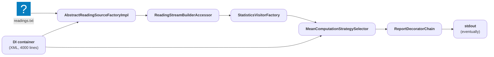
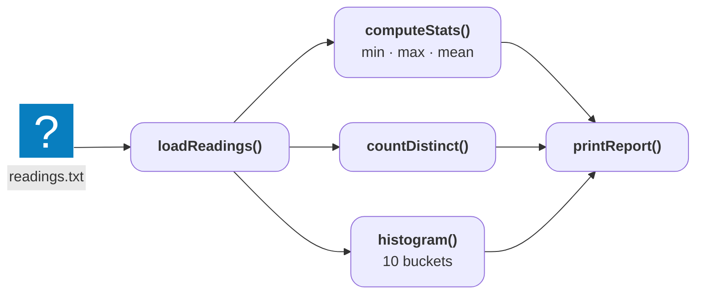
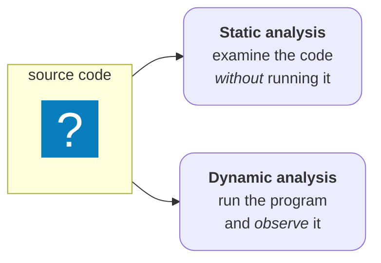
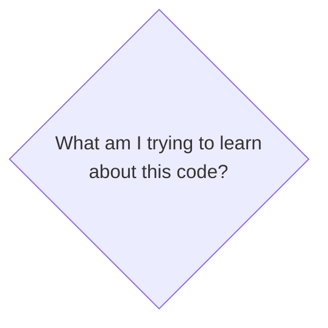

# Introduction: Code Analysis

---
layout: default
title: A tiny program
---

## A tiny program: `humidity-stats`

Loads integer humidity readings from a file, then prints:

<v-clicks at="2">

* minimum, maximum, and mean
* the number of distinct readings
* a histogram

</v-clicks>

<v-click>

<br>

<div class="grid grid-cols-2 gap-x-4 items-center">

<v-click at="1">

```txt [readings.txt ~i-vscode-icons:default-file~]{lines: false}
20 22 22 25 31 18 40 35 22 27
```

</v-click>

<v-click at="2">

<!-- Output from @/testing/0-initial/ (inputs in @/testing/inputs/), Apple clang 21, arm64, -O2 -->
````md magic-move {lines: false, at: 2}

```txt
```

```txt
min 18 max 40 mean 26
```

```txt
min 18 max 40 mean 26
distinct 8
```

```txt
min 18 max 40 mean 26
distinct 8
0 1 6 2 1 0 0 0 0 0
```

````

</v-click>

</div>

</v-click>

<!-- Notes:
* Pre-existing legacy code with bugs and limitations.
-->

---
layout: fact
title: The shape of humidity-stats
---

<v-switch>

<template #0>



</template>

<template #1>



</template>

</v-switch>

<!-- ### Notes:
* Enterprise quality coding
* ~120 lines across three files.
-->

---
layout: default
title: Run 2, boundary.txt
---

## Running the program

<!-- Snippet from @/testing/inputs/boundary.txt -->
```txt [boundary.txt ~i-vscode-icons:default-file~]{lines: false}
95 99 100 97
```

<v-click at="1">

````md magic-move {lines: false, at: 1}

```txt
```

```txt
min 95 max 100 mean 97
```

```txt
min 95 max 100 mean 97
distinct 4
```

```txt
min 95 max 100 mean 97
distinct 4
0 0 0 0 0 0 0 0 0 3
```

````

</v-click>

<v-clicks at="4">

* Four readings went in, but the histogram shows three
* No warning, no error, exit code `0`

</v-clicks>

---
layout: default
title: Run 3, corrupt.txt
---

## Running the program

<!-- Snippet from @/testing/inputs/corrupt.txt -->
```txt [corrupt.txt ~i-vscode-icons:default-file~]{lines: false}
2147483000 2147483000 50
```

<v-click at="1">

````md magic-move {at: 1, lines: false}

```sh
```

```sh
./humidity-stats corrupt.txt > out.txt
```

```sh
./humidity-stats corrupt.txt > out.txt
ㅤ
```

```sh
./humidity-stats corrupt.txt > out.txt; echo $?
138
```

````

</v-click>

<v-clicks at="2">

* `out.txt` is empty
* Non-zero exit code

</v-clicks>

---
layout: default
title: Run 4, empty.txt
---

## Running the program


```sh {lines: false}
./humidity-stats empty.txt
```

<br><br>

<div class="grid grid-cols-2 gap-x-4 items-center">

<div class="text-center" v-click>

### arm64 (Apple clang 21)

<!-- Verified locally: Apple clang 21.0.0, -std=c++20 -O2 -->
```txt {lines: false}
min 2147483647 max -2147483648 mean 0
```

exit code `0`

</div>

<div class="text-center" v-click>

### x86-64 (Clang 21.1)

<!-- Verified on x86-64 Clang 21.1 (godbolt clang2110), -std=c++20 -O2: @/testing/0-initial (stats.hpp + stats.cpp + main.cpp concatenated into one source) run remotely with argument empty.txt; the path does not exist there, which fails the first read exactly like an empty file -->
```txt {lines: false}
Program terminated with signal: SIGFPE
```

exit code `136`

</div>

</div>

<br><br>

<div class="text-center" v-click="3">

<span v-mark.red="3">Why is that allowed?</span>

</div>

---
layout: center
---

# Undefined Behavior (UB)

---
layout: quote
info: |
    https://eel.is/c++draft/defns.undefined
---

## "behavior for which this document imposes no requirements"

- C++ standard working draft, [\[defns.undefined\]](https://eel.is/c++draft/defns.undefined)

<v-click>

<br>

> "Permissible undefined behavior ranges from ignoring the situation completely with unpredictable results \[...\] to terminating a translation or execution"

</v-click>

---
layout: default
title: Why is C++ like this?
info: |
    B. Stroustrup, "The Design and Evolution of C++" (1994), §4.5:
    "What you don't use, you don't pay for (zero-overhead rule)."
---

## Why is C++ like this?

<br>

<v-clicks>

* Zero-overhead principle: you don't pay for checks you didn't ask for
* The compiler may assume undefined behavior never happens
* That assumption is exactly why the runs behaved in different ways
* The language won't watch your program run, <span v-mark.red="4">but tools can</span>

</v-clicks>

---
layout: fact
title: Static vs. dynamic analysis
---



<!-- ### Notes:
* Static: sees every path by inferring what **could** happen
* Dynamic: sees the real behavior but only where the program **actually ran**
-->

---
layout: default
title: Rice's theorem
info: |
    H. G. Rice, "Classes of Recursively Enumerable Sets and Their Decision Problems",
    Transactions of the American Mathematical Society, vol. 74 (1953), pp. 358-366.
---

## No tool can answer everything

Rice's theorem (1953): Non-trivial questions about what a program will do are for the most part undecidable

<v-clicks depth="2">

* Analysis tools approximate the behavior of programs
* False alarms and silent misses are inevitable
* The practical question becomes "what am I trying to learn?"

</v-clicks>

---
layout: fact
title: The question map
---


