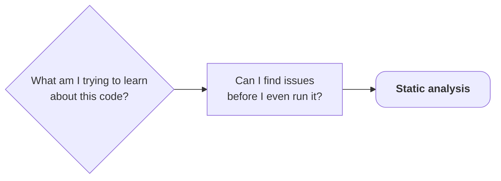

<!-- ### Notes:
* We'll try to find problems without even looking at the code ourselves
-->

---
layout: default
title: The compiler is a static analyzer
---

## You already own a static analyzer

<br>

````md magic-move {lines: false}

```sh
clang++ -std=c++20 -fsyntax-only stats.cpp main.cpp
```

```sh
clang++ -std=c++20 -fsyntax-only stats.cpp main.cpp
ㅤ
```

````

<v-clicks at="2">

* The compiler just parsed, type-checked, and resolved every line
* It noticed plenty, it just wasn't asked to tell you
* Diagnostics (beyond hard errors) are <span v-mark.red="4">opt-in</span>

</v-clicks>

---
layout: default
title: -Wall and -Wextra
---

## You already own a static analyzer

<br>

<!-- Snippet from @/testing/0-initial/main.cpp -> @/testing/1-post-static-analysis/main.cpp -->
````md magic-move[main.cpp ~i-vscode-icons:file-type-cpp~]{lines: false, at: 4}

```cpp
void printReport(const Stats& stats, bool verbose)
// ...
int checksum = 0;
printReport(computeStats(readings), false);
```

```cpp
void printReport(const Stats& stats)
// ...
printReport(computeStats(readings));
```

````

<br>

<!-- Verified: Apple clang 21.0.0, -std=c++20, -fsyntax-only -->

<v-click at="1">

````md magic-move{lines: false, at: 2}

```sh
clang++ -std=c++20 -fsyntax-only stats.cpp main.cpp
```

```sh
clang++ -std=c++20 -Wall -fsyntax-only stats.cpp main.cpp
```

```sh
clang++ -std=c++20 -Wall -Wextra -fsyntax-only stats.cpp main.cpp
```

````

</v-click>

<v-click at="1">

````md magic-move{lines: false, at: 2}

```txt
ㅤ
```

```txt
main.cpp:44:9: warning: unused variable 'checksum' [-Wunused-variable]
```

```txt
main.cpp:44:9: warning: unused variable 'checksum' [-Wunused-variable]
main.cpp:29:43: warning: unused parameter 'verbose' [-Wunused-parameter]
```

````

</v-click>

<v-click at="5">

* MSVC: `/W4` reports unused parameters (C4100) and initialized-but-unused locals (C4189)

</v-click>

<!-- ### Notes:
* `-Wall` is NOT "all warnings".
* `-Wextra` "enables some extra warning flags that are not enabled by -Wall."
* `-Wconversion` is enabled by neither.
* Verified verbatim on Apple clang 21 and GCC 16.1; GCC labels the file `<source>` but the line:column and wording match.
-->

---
layout: default
title: -Wconversion
---

## Opting in further: `-Wconversion`

<br>

<!-- Snippet from @/testing/0-initial/stats.cpp -->
```cpp [stats.cpp ~i-vscode-icons:file-type-cpp~]{*|5}{at: 1, lines: true}
Stats computeStats(const std::vector<int>& readings)
{
    // ...
    int sum = // sum of readings
    int count = readings.size();
    int mean = sum / count;
    return {minimum, maximum, mean};
}
```

<!-- Verified: Apple clang 21.0.0 + clang 22.1.8 (Linux, 2026-08-20): -Wall -Wextra -Wconversion
     emits this under the child flag -Wshorten-64-to-32; GCC 16.1,
     GCC 16.2.1 locally -->

<br>

<div class="grid grid-cols-2 gap-x-4 items-center">

<div v-click="1">

### Clang 21

```txt {lines: false}
warning: implicit conversion loses integer precision:
'size_type' (aka 'unsigned long') to 'int'
[-Wshorten-64-to-32]
```

</div>

<div v-click="2">

### GCC 16.1

```txt {lines: false}
warning: conversion from 'std::vector<int>::size_type'
{aka 'long unsigned int'} to 'int' may change value
[-Wconversion]
```

</div>

</div>

<v-clicks at="3">

* Same bug, different flag name and wording

</v-clicks>

---
layout: default
title: Same flag, different scope
---

## Even the *same flag* differs

<!-- Snippet from @/testing/0-initial/main.cpp -->
```cpp [main.cpp ~i-vscode-icons:file-type-cpp~]{*|6|6|6}{at: 1, lines: true}
std::array<int, 10> histogram(const std::vector<int>& readings)
{
    std::array<int, 10> buckets{};
    for (int r : readings)
    {
        ++buckets[r / 10];
    }
    return buckets;
}
```

<div class="grid grid-cols-2 gap-x-4 items-center">

<div v-click="1">

### Clang: `-Wconversion`

```txt {lines: false}
warning: implicit conversion changes signedness:
'int' to 'size_type' (aka 'unsigned long')
[-Wsign-conversion]
```

</div>

<div v-click="2">

### GCC: needs `-Wsign-conversion` too

```txt {lines: false}
warning: conversion to 'std::array<int, 10>::size_type'
{aka 'long unsigned int'} from 'int' may change the
sign of the result [-Wsign-conversion]
```

</div>

</div>

<v-click at="3">

* Clang's `-Wconversion` implies `-Wsign-conversion`, GCC's does **not**

</v-click>

---
layout: default
title: Cast, suppress, or ignore
---

## Evaluating the options

<br>

<!-- Snippet from @/testing/0-initial/main.cpp; the cast and the pragma are variants we show but do not keep -->
<!-- Verified: Apple clang 21.0.0 and GCC 16.2.0, -std=c++20 -Wall -Wextra -Wconversion -Wsign-conversion:
     the bare line warns, the cast and the pragma are both silent -->
````md magic-move[main.cpp ~i-vscode-icons:file-type-cpp~]{lines: false, at: 1}

```cpp
for (int r : readings)
{
    ++buckets[r / 10];
}
```

```cpp
for (int r : readings)
{
    ++buckets[static_cast<std::size_t>(r / 10)];
}
```

```cpp
for (int r : readings)
{
#pragma GCC diagnostic push
#pragma GCC diagnostic ignored "-Wsign-conversion"
    ++buckets[r / 10];
#pragma GCC diagnostic pop
}
```

```cpp
for (int r : readings)
{
    ++buckets[r / 10];
}
```

````

<br>

<v-click at="1">

* Casts state intent

</v-click>

<v-click at="2">

* Pragmas can suppress the diagnostic

</v-click>

<v-click at="3">

* We do neither

</v-click>

<!-- ### Notes:
* Casts state intent: the conversion is deliberate, and the compiler takes your word for it
* Pragmas can suppress the diagnostic: same code, one warning name, one place
* We do neither: the line is read far more often than it is compiled
-->

---
layout: default
title: linters
info: |
    https://clang.llvm.org/extra/clang-tidy/
---

## Linters

Reports suspicious patterns the compiler must accept (after C's `lint`, Bell Labs, 1978)

* `clang-tidy`
* `cppcheck`
* `include-what-you-use`

---
layout: default
title: clang-tidy findings
---

## Clang-tidy

<br>

* Clang-based: parses your code with a real compiler frontend

<v-clicks>

* Hundreds of checks in families: `bugprone-*`, `performance-*`, `modernize-*`, ...
* Configurable per-project via a `.clang-tidy` file

</v-clicks>

---
layout: default
title: clang-tidy findings
---

## Clang-tidy

<br>

```sh {lines: false}
clang-tidy stats.cpp --checks='-*,bugprone-*,performance-*,modernize-*' -- -std=c++20
clang-tidy main.cpp  --checks='-*,bugprone-*,performance-*,modernize-*' -- -std=c++20
```

<!-- Verified: clang-tidy 22.1.8 (Homebrew LLVM), -std=c++20 -->

<v-click>

```txt {lines: false}
stats.cpp:19:17: warning: narrowing conversion from 'size_type' (aka 'unsigned long')
to signed type 'int' is implementation-defined [bugprone-narrowing-conversions]
```

</v-click>

<v-click>

* The narrowing again: tools overlap

</v-click>

---
layout: default
title: clang-tidy findings
---

## Clang-tidy

<br>

```sh {lines: false}
clang-tidy stats.cpp --checks='-*,bugprone-*,performance-*,modernize-*' -- -std=c++20
clang-tidy main.cpp  --checks='-*,bugprone-*,performance-*,modernize-*' -- -std=c++20
```

```txt {lines: false}
main.cpp:36:5: warning: an exception may be thrown in function 'main'
which should not throw exceptions [bugprone-exception-escape]
```

<br>

<!-- Snippet from @/testing/0-initial/main.cpp (the chapter's tools run on the frozen listing; main is at line 36 there) -->
```cpp [main.cpp ~i-vscode-icons:file-type-cpp~]{hide|*|1,6}{at: 1}
std::vector<int>* loadReadings(const std::string& path);

int main(int argc, char* argv[])
{
    // ...
    loadReadings(argv[1]);
}
```

<!-- ### Notes:
* `argv[1]` becomes an `std::string` (bad_alloc / bad_array_new_length), and main is not allowed to throw.
* Toolchain nuance: fires against libc++. Against libstdc++ 16 the internal noexcept annotations differ and it stays silent.
-->

---
layout: default
title: clang-tidy noise
---

## The same run also said...

<br>

```txt {lines: false}
stats.cpp:6:1: warning: use a trailing return type for this function
[modernize-use-trailing-return-type]
```

<v-click at="1">

Seven times. <span v-click="2"> Plus:</span>

</v-click>

```txt {hide|*}{at: 2, lines: false}
873 warnings generated.
Suppressed 867 warnings (867 in non-user code).
```

<v-clicks at="3">

* Style checks are often opinions
* Check sets and signal-to-noise are your responsibility

</v-clicks>

---
layout: default
title: A puzzle
---

## Different tools, different misses

<!-- Snippet from @/testing/static-analysis/micro/clamp_bug.cpp -->
```cpp [clamp_bug.cpp ~i-vscode-icons:file-type-cpp~]{*|4,6}{at: 1}
// Clamp a raw humidity reading into the valid range [0, 100].
int clampReading(int reading)
{
    if (reading > 100)
    {
        if (reading < 0)
        {
            return 0;
        }
        return 100;
    }
    return reading;
}
```

---
layout: default
title: Only one tool caught it
clicks: 9
info: |
    https://cppcheck.sourceforge.io/
---

## Different tools, different misses

<br>

<!-- Verified 4 ways on @/testing/static-analysis/micro/clamp_bug.cpp: cppcheck 2.21.0 (macOS) / 2.21.1 (Linux) fires; Apple clang 21 -Wall -Wextra -Wconversion, GCC 16.1 -Wall -Wextra, and clang-tidy 22.1.8 with bugprone-* + clang-analyzer-* are all silent -->

<v-switch>

<template #0>

| Tool | Dead code reported |
|---|--:|

</template>

<template #1>

| Tool | Dead code reported |
|---|--:|
| clang `-Wall -Wextra -Wconversion` | <span v-click="2"><emojione-cross-mark-button/></span> |

</template>

<template #3>

| Tool | Dead code reported |
|---|--:|
| clang `-Wall -Wextra -Wconversion` | <emojione-cross-mark-button/> |
| GCC 16.1 `-Wall -Wextra` | <span v-click="4"><emojione-cross-mark-button/></span> |

</template>

<template #5>

| Tool | Dead code reported |
|---|--:|
| clang `-Wall -Wextra -Wconversion` | <emojione-cross-mark-button/> |
| GCC 16.1 `-Wall -Wextra` | <emojione-cross-mark-button/> |
| clang-tidy `bugprone-*` + `clang-analyzer-*` | <span v-click="6"><emojione-cross-mark-button/></span> |

</template>

<template #7-10>

| Tool | Dead code reported |
|---|--:|
| clang `-Wall -Wextra -Wconversion` | <emojione-cross-mark-button/> |
| GCC 16.1 `-Wall -Wextra` | <emojione-cross-mark-button/> |
| clang-tidy `bugprone-*` + `clang-analyzer-*` | <emojione-cross-mark-button/> |
| **cppcheck** `--enable=all` | <span v-click="8"><emojione-white-heavy-check-mark/></span> |

<v-click at="8">

```txt {lines: false}
clamp_bug.cpp:6:21: warning: Opposite inner 'if' condition leads to a dead code block. [oppositeInnerCondition]
```

</v-click>

<v-click at="9">

* Standalone, value-flow analysis notices the two conditions contradict each other

</v-click>

</template>

</v-switch>

<!-- ### Notes:
* cppcheck on humidity-stats itself (`cppcheck` with `enable=all`, 2.21.0): finds `checksum` (unreadVariable, overlaps -Wall / clang-tidy), and uniquely suggests `const` for `argv` (constParameter) and `std::any_of` instead of the raw loop in countDistinct (useStlAlgorithm). It does NOT report the narrowing, the leak, the OOB, the division by zero or the overflow.
-->

---
layout: default
title: Includes are dependencies
---

## The dependencies nobody reviews

Includes are also a matter of code analysis:

<v-clicks>

* Every `#include` is a **transitive** dependency declaration
* Code that compiles "by luck" is fragile
* Dead includes silently tax every rebuild

</v-clicks>

---
layout: default
title: include-what-you-use
info: |
    https://include-what-you-use.org/
---

## `include-what-you-use`

<br>

<!-- Snippets from @/testing/0-initial/ -> @/testing/1-post-static-analysis/ -->
````md magic-move{lines: false, at: 4}

```cpp
// stats.hpp
#include <string>
#include <vector>
// main.cpp
#include <array>
#include <fstream>
#include <iostream>
```

```cpp
// stats.hpp
#include <vector>
// main.cpp
#include <array>
#include <fstream>
#include <iostream>
#include <string>
#include <vector>
```

````

<!-- Verified: IWYU 0.26 (clang 22.1.8), -std=c++20. On macOS pass `-isysroot "$(xcrun --show-sdk-path)"` so the clang-22-based IWYU finds the SDK headers.
     Trimmed from the output: `stats.cpp should add these lines: #include <cstddef>  // for size_t`. -->

```sh {lines: false}
include-what-you-use -std=c++20 stats.cpp
include-what-you-use -std=c++20 main.cpp
```

<v-click>

```txt {lines: false}
stats.hpp should remove these lines:
- #include <string>  // lines 3-3

main.cpp should add these lines:
#include <string>     // for basic_string, string
#include <vector>     // for vector
```

</v-click>

<div v-click="[2,4]">

<v-clicks at="2">

* `<string>` is dead weight in `stats.hpp`
* But `main.cpp` used `std::string` and `std::vector` *through* it

</v-clicks>

</div>

---
layout: default
title: What static analysis proves
---

## Static analysis

<br>

The tools checked <span v-mark.red>all inputs and all paths.</span><span v-click> And yet...</span>

<v-click>

* A reading vanishes

<!-- Baseline runs of the surface-fixed build (@/testing/1-post-static-analysis), Apple clang 21 arm64 -O2. The surface fixes touch none of the deep-bug code paths, so behavior is identical to 0-initial; re-checked on Linux x86-64 (clang 22.1.8): exit codes on boundary/corrupt/empty byte-identical between the two snapshots. -->
```txt {lines: false}
./humidity-stats boundary.txt  ->  0 0 0 0 0 0 0 0 0 3             (exit 0)
```

</v-click>

<v-click>

* A crash with lost output

<!-- macOS exit 138 (SIGBUS); Linux: 139 (SIGSEGV) -->
```txt {lines: false}
./humidity-stats corrupt.txt   ->  output lost in a crash          (exit 138)
```

</v-click>

<v-click>

* Garbage with no error

<!-- arm64: the division returns 0 and the run continues; x86-64 traps with SIGFPE, exit 136 (see the intro) -->
```txt {lines: false}
./humidity-stats empty.txt     ->  min 2147483647 max -2147483648  (exit 0)
```

</v-click>
