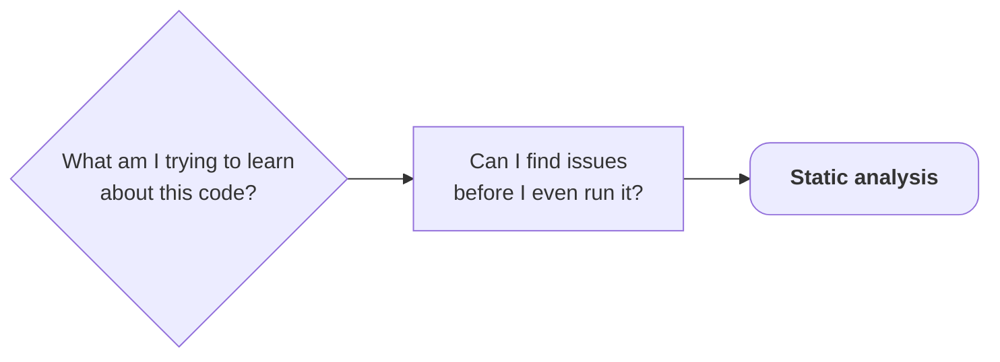
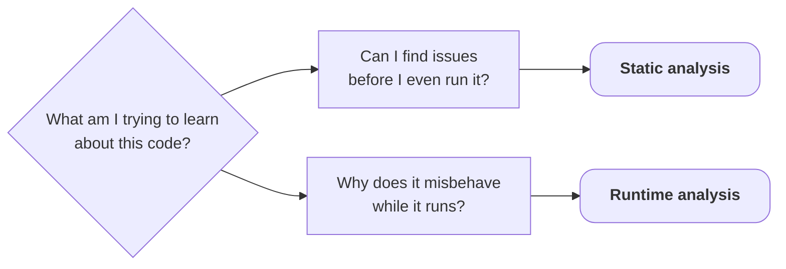
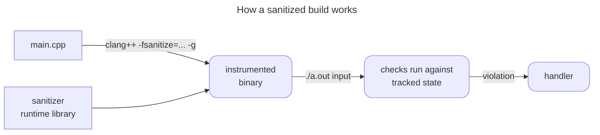

<v-switch>

<template #0>



</template>

<template #1>



</template>

</v-switch>

---
layout: default
title: Debuggers as analysis tools
---

## Start with the tool you already have

A debugger + debug build (`-O0 -g`):

<!-- Verbatim (trimmed): @/testing/runtime-analysis/build/lldb_corrupt.txt - ss-debug build, -O0 -g.
     Stop-reason wording is macOS (EXC_BAD_ACCESS); Linux says "signal SIGSEGV". The buckets line is
     the Linux capture (libstdc++ prints _M_elems, libc++ __elems_), elements trimmed.
     The capture used `frame variable`; slides show `print` (dwim-print, same lookup, no `$0`), whose
     result line drops the variable name: `(int) 2147483000`. Re-verified on lldb-2100. -->

```sh
lldb -- ./humidity-stats corrupt.txt
```

````md magic-move {lines: false, at: 1}

```
```txt
(lldb) run
```

```txt {2-4|4}
(lldb) run
stop reason = EXC_BAD_ACCESS (code=2, address=0x1a31318b8)
  frame #0: histogram(readings=size=3) at main.cpp:26
->  26    ++buckets[r / 10];
```

```txt {5}
(lldb) run
stop reason = EXC_BAD_ACCESS (code=2, address=0x1a31318b8)
  frame #0: histogram(readings=size=3) at main.cpp:26
->  26    ++buckets[r / 10];
(lldb) print r
```

```txt {6}
(lldb) run
stop reason = EXC_BAD_ACCESS (code=2, address=0x1a31318b8)
  frame #0: histogram(readings=size=3) at main.cpp:26
->  26    ++buckets[r / 10];
(lldb) print r
(int) 2147483000
```

```txt{7}
(lldb) run
stop reason = EXC_BAD_ACCESS (code=2, address=0x1a31318b8)
  frame #0: histogram(readings=size=3) at main.cpp:26
->  26    ++buckets[r / 10];
(lldb) print r
(int) 2147483000
(lldb) print buckets
```

```txt {8|4,6,8}
(lldb) run
stop reason = EXC_BAD_ACCESS (code=2, address=0x1a31318b8)
  frame #0: histogram(readings=size=3) at main.cpp:26
->  26    ++buckets[r / 10];
(lldb) print r
(int) 2147483000
(lldb) print buckets
(std::array<int, 10>) { _M_elems = ([0] = 0, ..., [9] = 0) }
```

````

<!-- Snippet from @/testing/1-post-static-analysis/main.cpp -->
```cpp [main.cpp ~i-vscode-icons:file-type-cpp~]{hide|6|hide}{at: 2}
std::array<int, 10> histogram(const std::vector<int>& readings)
{
    std::array<int, 10> buckets{};
    for (int r : readings)
    {
        ++buckets[r / 10];
    }
    return buckets;
}
```

---
layout: default
title: The debugger's fix
---

## The fix: garbage stays out of the histogram

<!-- Snippet @/testing/1-post-static-analysis/main.cpp -> @/testing/runtime-analysis/steps/1-after-debugger/main.cpp.
     The program's input contract: readings are 0-100, hence the 10 buckets. The guard rejects exactly what the debugger showed, nothing else. -->
````md magic-move[main.cpp ~i-vscode-icons:file-type-cpp~]{at: 1}

```cpp
std::array<int, 10> buckets{};
for (int r : readings)
{
    ++buckets[r / 10];
}
```

```cpp
std::array<int, 10> buckets{};
for (int r : readings)
{
    if (r < 0 || r > 100)
    {
        continue;
    }
    ++buckets[r / 10];
}
```

````

<br>

<v-click at="2">

<!-- Verbatim (histogram line): @/testing/runtime-analysis/build/stateB_corrupt.out - steps/1-after-debugger, clang 22.1.8 -O2, Linux (2026-09-02).
     Full output: min 50 max 2147483000 mean -415 / distinct 2 / this line / exit 0. The mean is the wrapped int sum (still UB here). -->
```txt {lines: false}
./humidity-stats corrupt.txt    # 2147483000 2147483000 50
0 0 0 0 0 1 0 0 0 0           (outside the documented range: discarded)
```

</v-click>

<v-click at="3">

<!-- Verbatim: @/testing/runtime-analysis/build/stateB_boundary.out - the guard changed nothing here -->
```txt {lines: false}
./humidity-stats boundary.txt    # 95 99 100 97
0 0 0 0 0 0 0 0 0 3            (four readings in, three counted, exit 0)
```

</v-click>

<!-- ### Notes:
* In the last snippet, we can't rely on the debugger to stop on a crash
-->

---
layout: default
title: What a sanitizer is
info: |
    https://clang.llvm.org/docs/AddressSanitizer.html
---

## Sanitizers

Compiler instrumentation + a runtime library

<v-clicks depth="2">

* The compiler injects checks
    * Memory accesses
    * Arithmetic
    * Threads
* A runtime library tracks extra state
* On a violation: handle the error
    * By default: print a report and abort

</v-clicks>

---
layout: fact
title: How a sanitized build works
---



---
layout: default
title: AddressSanitizer
---

## ASan: Address Sanitizer

```sh {lines: false}
g++ -std=c++20 -g -O0 -fsanitize=address stats.cpp main.cpp -o ss-asan
./ss-asan boundary.txt
```

<!-- Verbatim (trimmed): @/testing/runtime-analysis/build/asan_boundary.txt - steps/1-after-debugger, clang 22.1.8 (2026-09-02) -->
```txt {hide|*|1|2-4}{lines: false}
==ERROR: AddressSanitizer: stack-buffer-overflow
READ of size 4 at 0x... thread T0
    #0 in histogram(std::vector<int> const&) main.cpp:30
    #1 in main main.cpp:60
...
SUMMARY: AddressSanitizer: stack-buffer-overflow
         main.cpp:30 in histogram(...)
```

<v-clicks at="2">

* The error class
* The call stack that got there

</v-clicks>

<!-- ### Notes:
* "READ of size 4": `int`
-->

---
layout: default
title: The ASan fix
---

<!-- Verified: @/testing/runtime-analysis/build/stateC_asan_boundary.out - ASan build of steps/2-after-asan, no report, prints min 95 max 100 mean 97 / distinct 4 / 0 0 0 0 0 0 0 0 0 4. -->

## ASan fix

<!-- Snippet @/testing/runtime-analysis/steps/1-after-debugger/main.cpp -> steps/2-after-asan/main.cpp -->
````md magic-move[main.cpp ~i-vscode-icons:file-type-cpp~]{at: 1}

```cpp
if (r < 0 || r > 100)
{
    continue;
}
++buckets[r / 10];
```

```cpp
if (r < 0 || r > 100)
{
    continue;
}
++buckets[std::min(r / 10, 9)];
```

````

<v-click at="2">

```txt {lines: false}
./humidity-stats boundary.txt    # 95 99 100 97
0 0 0 0 0 0 0 0 0 4
```

</v-click>

---
layout: default
title: UndefinedBehaviorSanitizer
---

## UBSan: Undefined Behavior Sanitizer

`corrupt.txt` no longer crashes:

<!-- Verbatim (first line): @/testing/runtime-analysis/build/stateB_corrupt.out / stateC_corrupt.out -->
```txt {lines: false}
./humidity-stats corrupt.txt     # 2147483000 2147483000 50
min 50 max 2147483000 mean -415
```

<v-click>

`-fsanitize=undefined`:

<!-- Verbatim: @/testing/runtime-analysis/build/ubsan_corrupt.txt - steps/2-after-asan, clang 22.1.8 (2026-09-02) -->
```txt {lines: false}
stats.cpp:17:13: runtime error: signed integer overflow:
2147483000 + 2147483000 cannot be represented in type 'int'
```

</v-click>

<!-- Snippet from @/testing/runtime-analysis/steps/2-after-asan/stats.cpp (computeStats unchanged since chapter 2) -->
```cpp [stats.cpp ~i-vscode-icons:file-type-cpp~]{hide|5}{at: 2, lines: true}
int sum = 0;

for (int r : readings)
{
    sum += r;
}
```

<v-click at="3">

* No compiler warned: the compiler may *assume* UB never happens.

</v-click>

---
layout: default
title: The UBSan fix
---

## The fix: a type that states the intent

<!-- Snippet @/testing/runtime-analysis/steps/2-after-asan/stats.cpp -> steps/3-after-ubsan/stats.cpp -->
````md magic-move [stats.cpp ~i-vscode-icons:file-type-cpp~]{at: 1, lines: true}

```cpp {*|1}
int sum = 0;

for (int r : readings)
{
    sum += r;
}
```

```cpp {1}
std::int64_t sum = 0;

for (int r : readings)
{
    sum += r;
}
```

````

<!-- ### Notes:
* why not unsigned: unsigned overflow is well-defined (it wraps), but a silently wrapped sum is still the wrong sum.
-->

<v-click at="3">

<!-- Verbatim: @/testing/runtime-analysis/build/stateD_ubsan_corrupt.out - UBSan build of steps/3-after-ubsan, no report (2026-09-02) -->
```txt {lines: false}
min 50 max 2147483000 mean 1431655350
```

</v-click>

---
layout: default
title: LeakSanitizer
---

## LSan: Leak Sanitizer

<!-- Snippet from @/testing/runtime-analysis/steps/3-after-ubsan/main.cpp (loadReadings unchanged since the chapter start) -->
```cpp [main.cpp ~i-vscode-icons:file-type-cpp~]{*|3,10|13}{at: 1}
std::vector<int>* loadReadings(const std::string& path)
{
    auto* readings = new std::vector<int>;
    std::ifstream in(path);
    int value = 0;
    while (in >> value)
    {
        readings->push_back(value);
    }
    return readings;
}
// ... in main():
const std::vector<int>& readings = *loadReadings(argv[1]);
```

---
layout: default
title: The LSan report
---

## Leak Sanitizer report

<!-- Build line from @/testing/runtime-analysis/run-all.sh (LSan section); the report is checked at process exit -->
```sh {lines: false}
clang++ -std=c++20 -g -O0 -fsanitize=leak stats.cpp main.cpp -o ss-lsan
./ss-lsan readings.txt
```

<!-- Verbatim (trimmed): @/testing/runtime-analysis/build/lsan_run.txt - steps/3-after-ubsan, Linux clang 22.1.8 (2026-09-02) -->
```txt {*|2-4|5-6|7}{at: 1, lines: false}
==ERROR: LeakSanitizer: detected memory leaks
Direct leak of 24 byte(s) in 1 object(s) allocated from:
    #1 in loadReadings(...) main.cpp:12
    #2 in main main.cpp:51
Indirect leak of 64 byte(s) in 1 object(s) allocated from:
    ...                                    (the vector's heap buffer)
SUMMARY: LeakSanitizer: 88 byte(s) leaked in 2 allocation(s).
```

<v-clicks at="1">

* Direct leak: the `std::vector` object itself
* Indirect leak: the vector's heap buffer
* 88 bytes in 2 allocations

</v-clicks>

<!-- ### Notes:
* Why the static tools lose (verified on the program and on @/testing/static-analysis/micro/leak_replica.cpp: compiler, clang-tidy, clang-analyzer, cppcheck all silent): ownership crosses a function boundary, then `*loadReadings()` binds to a `const&` and the owning pointer is gone from anything the checkers track. Symbolic execution is budgeted and mostly per translation unit.
* A same-function `new` without `delete` IS caught by clang-analyzer (the sanity check in chapter 2). This pattern is where the approximation gives up: Rice's theorem, in practice.
* `std::unique_ptr` would have been analyzable intent; the fix on the next slide goes one step further and drops the heap allocation altogether.
-->

---
layout: default
title: The LSan fix
---

## Leak Sanitizer report

<!-- Snippet @/testing/runtime-analysis/steps/3-after-ubsan/main.cpp -> @/testing/2-post-runtime-analysis/main.cpp -->
````md magic-move[main.cpp ~i-vscode-icons:file-type-cpp~]{at: 1}

```cpp
std::vector<int>* loadReadings(const std::string& path)
{
    auto* readings = new std::vector<int>;
    // ... read the file ...
    return readings;
}
// ... in main():
const std::vector<int>& readings = *loadReadings(argv[1]);
```

```cpp
std::vector<int> loadReadings(const std::string& path)
{
    std::vector<int> readings;
    // ... read the file ...
    return readings;
}
// ... in main():
const std::vector<int> readings = loadReadings(argv[1]);
```

````

<!-- ### Notes:
* One additional benefit is that it lets RVO optimize things
-->

---
layout: default
title: ThreadSanitizer
---

## TSan: Thread Sanitizer

Suppose a colleague "sped up" the sum:

<!-- Snippet from @/testing/runtime-analysis/parallel/stats.cpp - a side branch of the chapter-start state, NOT part of the program's progression; say so out loud -->
```cpp [stats.cpp ~i-vscode-icons:file-type-cpp~]{*|1,6}{at: 1}
int sum = 0;
auto worker = [&](std::size_t lo, std::size_t hi)
{
    for (std::size_t i = lo; i < hi; ++i)
    {
        sum += readings[i];
    }
};

const std::size_t mid = readings.size() / 2;
std::thread t1(worker, 0, mid);
std::thread t2(worker, mid, readings.size());
```

<v-clicks at="2">

* Shared accumulator, no lock
* Half the time, it works every time

</v-clicks>

---
layout: default
title: The TSan report
---

## Two threads, one unguarded write

```sh {lines: false}
clang++ -std=c++20 -g -O0 -fsanitize=thread stats.cpp main.cpp -o ss-tsan
./ss-tsan readings.txt
```

<!-- Verbatim (std:: template frames trimmed): @/testing/runtime-analysis/build/tsan_race_O0.txt -->
```txt {*|1|2-5|6-7|*}{at: 1, lines: false}
WARNING: ThreadSanitizer: data race
  Write of size 4 at 0x... by thread T2:
    #0 computeStats(...)::operator()(...) stats.cpp:27
  Previous write of size 4 at 0x... by thread T1:
    #0 computeStats(...)::operator()(...) stats.cpp:27
  Thread T2 (running) created by main thread at: ... stats.cpp:31
  Thread T1 (finished) created by main thread at: ... stats.cpp:30
```

<!-- Verified: @/testing/runtime-analysis/build/tsan_fixed.txt - parallel/stats_fixed.cpp (std::atomic<int> sum) is TSan-clean with correct output; the code is on the appendix slide -->

<v-clicks at="1">

* Race reported by TSan
* Both conflicting accesses
* Where each thread was created
* The fix: Use `std::atomic<int> sum`

</v-clicks>

<!-- ### Notes:
* TSan reasons about the C++ happens-before relation, not the hardware: a race that happens to "work" on x86-64's strong (TSO) ordering can still be flagged.
-->

---
layout: default
title: Costs and limitations
info: |
    https://clang.llvm.org/docs/AddressSanitizer.html
    https://clang.llvm.org/docs/ThreadSanitizer.html
    https://clang.llvm.org/docs/UndefinedBehaviorSanitizer.html
    https://clang.llvm.org/docs/LeakSanitizer.html
---

## What it costs

<!-- Numbers verbatim from the clang sanitizer pages (re-verified 2026-09-14). "Typical" is the
     docs' own word: "Typical slowdown introduced by AddressSanitizer is 2x", "Typical slowdown
     introduced by ThreadSanitizer is about 5x-15x", "Typical memory overhead ... about 5x-10x",
     "LSan adds almost no performance overhead until the very end of the process". UBSan's page
     gives no figure, only "The checks have small runtime cost" - "check-dependent" is ours. -->

| Tool | Typical slowdown |
|---|---|
| ASan | ~2× |
| TSan | 5-15× (and 5-10× memory) |
| UBSan | low, check-dependent |
| LSan | ~none (checks at exit) |

---
layout: default
title: Combining sanitizers
---

## Can I turn them all on at once?

<!-- Verified: clang 22.1.8, Linux, 2026-08-20 - every pair below tested via -fsanitize=a,b -->

| | ASan | LSan | TSan | UBSan |
|---|---|---|---|---|
| **ASan** | -- | <emojione-white-heavy-check-mark/> | <emojione-cross-mark-button/> | <emojione-white-heavy-check-mark/> |
| **LSan** | <emojione-white-heavy-check-mark/> | -- | <emojione-cross-mark-button/> | <emojione-white-heavy-check-mark/> |
| **TSan** | <emojione-cross-mark-button/> | <emojione-cross-mark-button/> | -- | <emojione-white-heavy-check-mark/> |
| **UBSan** | <emojione-white-heavy-check-mark/> | <emojione-white-heavy-check-mark/> | <emojione-white-heavy-check-mark/> | -- |

<v-clicks>

* UBSan stacks with everything
* Shadow-memory clashes (ASan, TSan)
* LSan is unavailable on Apple Silicon
* MSVC `/fsanitize` is ASan-only
* Typical CI split: one ASan+LSan+UBSan job, one TSan job

</v-clicks>
