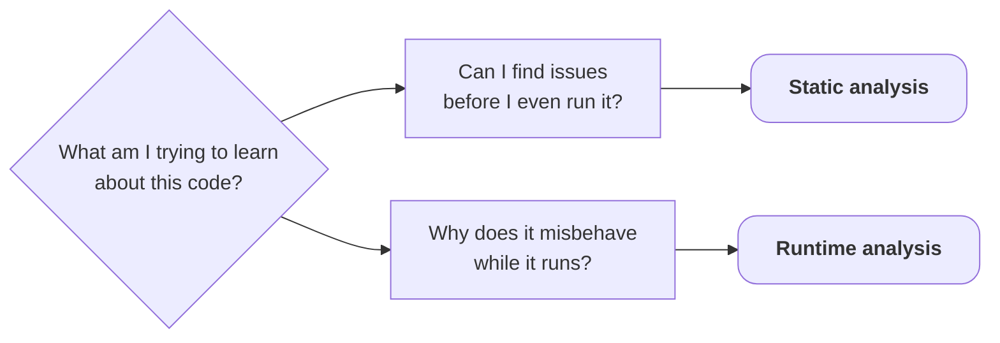
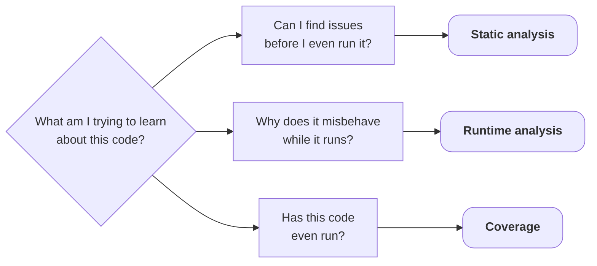

<v-switch>

<template #0>



</template>

<template #1>



</template>

</v-switch>

<!-- ### Notes:
* Sanitizers only check code that actually ran. What about the code that never ran?
-->

---
layout: default
---

## Coverage

Using coverage checks, you get to:

<v-clicks>

* Understand which parts of your code have been executed
* Identify untested code paths
* Get a cool badge for your repo's README: 

</v-clicks>

---
layout: default
title: Coverage in four commands
info: |
    https://clang.llvm.org/docs/SourceBasedCodeCoverage.html
---

## Source-based coverage

<!-- Run on @/testing/2-post-runtime-analysis; verified: LLVM 22.1.8 (re-run 2026-09-02 after the histogram guard landed); regenerate: @/testing/coverage/run-all.sh. One instrumented binary, four merged runs (readings, boundary, corrupt, and a no-argument usage-error run). -->

```sh {none}{lines: false}
clang++ -std=c++20 -fprofile-instr-generate -fcoverage-mapping stats.cpp main.cpp -o humidity-stats
LLVM_PROFILE_FILE=readings.profraw ./humidity-stats readings.txt
llvm-profdata merge -sparse *.profraw -o merged.profdata
llvm-cov report ./humidity-stats -instr-profile merged.profdata
```

<!-- llvm-cov report, verbatim numbers: 4 merged runs (readings/boundary/corrupt/usage); @/testing/coverage/build/report.txt -->

| File | Functions | Lines | Branches |
|---|---|---|---|
| `stats.cpp` | 100.00 % | 100.00 % | 100.00 % |
| `main.cpp` | 100.00 % | 93.48 % | 85.71 % |

<v-click>

* `main.cpp`: 3 lines and 2 branch outcomes that *nothing* has ever executed

</v-click>

---
layout: default
title: Where coverage earns its keep
---

## Where coverage earns its keep

```sh {lines: false}
llvm-cov show ./humidity-stats -instr-profile merged.profdata main.cpp
```

<div v-click>

<!-- Verbatim excerpt: @/testing/coverage/build/show-main.txt -->
```txt {lines: false}
   53|      3|    if (readings.empty())
   54|      0|    {
   55|      0|        std::cout << "warning: no readings loaded\n";
   56|      0|    }
   57|       |
   58|      3|    printReport(computeStats(readings));
```

</div>

<v-clicks at="2">

* Execution count `0`: We forgot to test the empty file case
* The other never-taken outcome is `r < 0` in the histogram

</v-clicks>

---
layout: default
title: Running what never ran
---

## Running what never ran

One binary carrying coverage and UBSan

```sh {lines: false}
./ss-ubsan-cov empty.txt
```

<v-click at="1">

````md magic-move {at: 1, lines: false}

```txt
```

<!-- stderr (UBSan) and stdout (report) interleaved as captured through a pipe;
     on a live tty the warning line prints before the UBSan report.
     arm64 output: the div returns 0 and the run continues. On x86-64 the div
     traps (SIGFPE) right after the report, so run-all.sh adds -fprofile-continuous
     + %c so the counters survive either way -->
```txt {*|3|1-2|4}
stats.cpp:21:20: runtime error: division by zero
SUMMARY: UndefinedBehaviorSanitizer: undefined-behavior stats.cpp:21:20
warning: no readings loaded
min 2147483647 max -2147483648 mean 0
```

````

</v-click>

<v-clicks depth="2" at="2">

* The branch now executed, but forgot to `return`
* `sum / count` with `count == 0`
    * arm64 returned 0

</v-clicks>

<!-- ### Notes:
* I hope I don't have to explain why this one is UB.
-->

---
layout: default
title: The fix
---

## The fix coverage was pointing at

<div class="grid grid-cols-2 gap-x-4 items-center">

<!-- Snippet from @/testing/3-post-coverage/main.cpp -->
````md magic-move[main.cpp ~i-vscode-icons:file-type-cpp~]{at: 1}

```cpp
if (readings.empty())
{
    std::cout << "warning: no readings loaded\n";
}

printReport(computeStats(readings));
```

```cpp {3-4}
if (readings.empty())
{
    std::cout << "warning: no readings loaded\n";
    return 0;
}

printReport(computeStats(readings));
```

````

<div v-click="2">

<!-- Verbatim: @/testing/coverage/build/fixed-empty.txt - same flags as the previous slide, built from @/testing/3-post-coverage -->
```sh {lines: false}
./ss-fixed empty.txt
```

```txt {lines: false}
warning: no readings loaded
```

exit code `0`, UBSan silent

</div>

</div>

---
layout: default
title: Map, not grade
info: |
    Goodhart's law, in Marilyn Strathern's popular phrasing ("Improving ratings:
    audit in the British University system", European Review 5(3), 1997, p. 308).
    Goodhart's own 1975 wording was about statistical regularities collapsing
    under control pressure.
---

## Coverage is a map, not a grade

100% covered $\neq$ 100% correct

<!-- Formatting claim verified (llvm-cov 22.1.8): the one-liner's line count is 1 whichever way the condition went; the untaken sub-line region and branch still show as missed in the Regions/Branches columns. -->

<v-clicks depth="2">

* The division ran in every single run, just never with `count == 0`
* Easy to satisfy without actually testing anything meaningful
* Branch coverage is stricter than line coverage
    * `if (x > 0) { return 1; }` is one line either way

</v-clicks>

<!-- ### Notes:
* A map shows where you have been, not whether the trip was worth it.
* Goodhart's law: when a measure becomes a target, it ceases to be a good measure
    * The badge from the start of this chapter is a trap
* Every test input is now handled, but what protects production?
-->
