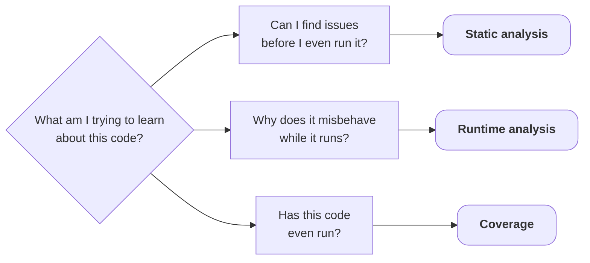
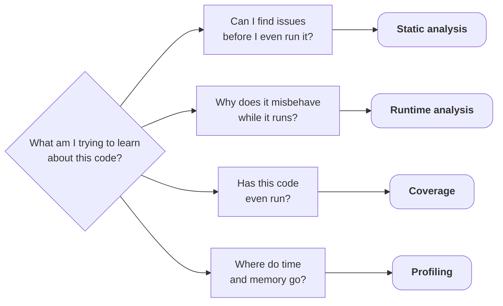

<v-switch>

<template #0>



</template>

<template #1>



</template>

</v-switch>

<!-- ### Notes:
* The program is now correct on every input. But why is it slow?
-->

---
layout: default
title: Correct is not fast
---

## Correct ≠ fast

```sh {lines: false}
time -p ./humidity-stats big.txt        # 20,000,000 readings, 55 MB
```

<div v-click>

<!-- Slow build = @/testing/3-post-coverage at -O2 -g; timing = /usr/bin/time -p, 3 runs (first run shown: build/linux100/time_slow.txt + out-slow.txt).
     Re-captured 2026-09-12 at 0..100 on Linux aarch64 (Docker, Ubuntu 24.04, g++ 13.3, Apple M5 host), the same host as the
     perf and heaptrack captures, so every number in this chapter is one machine. Artifacts: build/linux100/.
     big.txt spans 0..100 (gen.cpp default) because relative humidity is a percentage: every reading passes the
     range guard, so the histogram line prints normally, trimmed from the slide only for space. -->
```txt {lines: false}
min 0 max 100 mean 50
distinct 101
...

real 2.02
user 2.01
sys 0.01
```

</div>

<v-clicks at="2">

* Parsing 55 MB?
* The histogram?
* The stats?

</v-clicks>

<span v-mark.red="5" v-click="5">Don't guess.</span>

---
layout: quote
info: |
    D. E. Knuth, "Structured Programming with go to Statements",
    ACM Computing Surveys 6(4), 1974, p. 268. https://doi.org/10.1145/356635.356640
---

<!-- Quote verified verbatim against the paper (p. 268, same page as the premature-optimization line), 2026-08-20 -->

## "It is often a mistake to make a priori judgments about what parts of a program are really critical, since the universal experience of programmers who have been using measurement tools has been that their intuitive guesses fail."

- Donald E. Knuth, *Structured Programming with go to Statements* (1974)

<!-- ### Notes:
* The same page gave us *"premature optimization is the root of all evil"*
* He was telling us to measure.
-->

---
layout: default
title: Sampling vs. instrumentation
info: |
    perf-record(1): https://man7.org/linux/man-pages/man1/perf-record.1.html
    Callgrind manual: https://valgrind.org/docs/manual/cl-manual.html
---

## Two ways to profile

<br><br>

<div class="grid grid-cols-2 gap-x-4">

<div>

### Sampling

<v-clicks at="1">

* Interrupt N times, record the call stack
* Low overhead
* Statistical: percentages, not counts
* No rebuild needed
* *perf (Linux), macOS `sample`*

</v-clicks>

</div>

<div>

### Instrumentation

<v-clicks at="1">

* Insert counting code around every call / allocation
* High overhead (2-50×), can perturb timing
* **Exact** counts
* Rebuild or binary-translation runtime
* *callgrind, gprof, heaptrack*

</v-clicks>

</div>

</div>

<!-- ### Notes:
* Sampling is like taking a photograph of the program while it runs
-->

---
layout: default
title: CPU profiling with perf
---

## CPU profiling with `perf`

<!-- Ran inside Docker Desktop on a macOS host (image: Dockerfile.perf)
* Full command: `perf record -F 999 -e cpu-clock --call-graph dwarf -o perf.data ./ss-slow-linux big.txt`
* `-F 999`: sample at 999 Hz; `-e cpu-clock`: software clock (no PMU inside Docker); `--call-graph dwarf`: unwind the stack at each sampl
-->

```sh {lines: false}
perf record [...] ./ss-slow-linux big.txt
```

```txt {hide|*}{at: 1, lines: false}
[ perf record: Captured and wrote 87.1 MB perf.data (10687 samples) ]
```

```sh {hide|*}{at: 2, lines: false}
perf report --no-children
```

<!-- Verbatim (symbols shortened for the slide): @/testing/profiling/build/linux100/perf_report_selftime.txt
     Re-captured 2026-09-12 at 0..100. -->
```txt {hide|*|1}{at: 3, lines: false}
  65.67%  countDistinct(const std::vector<int>&)
  12.57%  std::num_get<>::_M_extract_int<long>
   5.18%  std::istream::sentry::sentry
   2.69%  std::istream::operator>>(int&)
   1.08%  histogram(const std::vector<int>&)
   0.93%  computeStats(const std::vector<int>&)
```

---
layout: default
title: The culprit
---

## The culprit: `countDistinct`

<!-- Snippet from @/testing/3-post-coverage/stats.cpp (condensed braces) -->
```cpp [stats.cpp ~i-vscode-icons:file-type-cpp~]{*|4,7|9}{at: 1}
int countDistinct(const std::vector<int>& readings)
{
    int distinct = 0;
    for (std::size_t i = 0; i < readings.size(); ++i)
    {
        bool seen = false;
        for (std::size_t j = 0; j < i; ++j)
        {
            if (readings[j] == readings[i]) { seen = true; break; }
        }
        if (!seen) ++distinct;
    }
    return distinct;
}
```

<v-clicks at="1">

* $O(n \cdot d)$ ($d$ = 101 distinct values)
* 20 M readings × ~101 distinct values $\approx 2 \cdot 10^9$ comparisons

</v-clicks>

---
layout: default
title: The fix
---

## The fix: one hash-set pass

<!-- Alternatives measured in-process (steady_clock), same 20 M-reading big.txt, 101 distinct values, Linux aarch64 (Docker, Ubuntu 24.04, g++ 13.3, Apple M5 host), two stable runs (build/linux100/alts.txt):
* `std::unordered_set` **22.5 ms** <- the fix on the slide
* sort+unique 736 ms: 33x slower
* `std::ranges::sort` + `std::ranges::unique` 737 ms
-->

<!-- Snippets from @/testing/3-post-coverage/stats.cpp and @/testing/4-post-profiling/stats.cpp -->
````md magic-move[stats.cpp ~i-vscode-icons:file-type-cpp~]{at: 1}

```cpp
int countDistinct(const std::vector<int>& readings)
{
    int distinct = 0;
    for (std::size_t i = 0; i < readings.size(); ++i)
    {
        bool seen = false;
        for (std::size_t j = 0; j < i; ++j)
        {
            if (readings[j] == readings[i]) { seen = true; break; }
        }
        if (!seen) ++distinct;
    }
    return distinct;
}
```

```cpp
int countDistinct(const std::vector<int>& readings)
{
    const std::unordered_set<int> seen(readings.begin(), readings.end());
    return seen.size();
}
```

````

---
layout: default
title: Measure again
---

## Measure again

<!-- Phases: steady_clock harness (diag.cpp); totals: /usr/bin/time -p, 3 runs, Apple M5 -->

| | before | after | |
|---|---|---|---|
| `countDistinct` | 1335 ms | 24 ms ||
| parse / load | 669 ms | 660 ms | |
| **total (wall)** | **2.02 s** | **0.71 s** | **~2.8× faster** |

<v-clicks>

* The next hot spot is parsing (93 % of what is left)
* Measure $\to$ change $\to$ re-measure

</v-clicks>

<!-- ### Notes:
* Linux aarch64 (Docker, Ubuntu 24.04, g++ 13.3, Apple M5 host), 3 runs, /usr/bin/time -p; phases from diag.cpp. Artifacts: build/linux100/time_{slow,fast}.txt and diag_{slow,fast}.txt, re-captured 2026-09-12 at 0..100.
-->

---
layout: default
title: The other axis, memory
---

## Where does the *memory* go?

<v-clicks>

* A memory profiler answers "where are the bytes"
* `heaptrack` intercepts every `malloc`/`free` (instrumentation)
    * peak heap
    * allocation counts
    * leaks

</v-clicks>

<v-click>

```sh {lines: false}
heaptrack ./ss-fast-linux big.txt
heaptrack_print heaptrack.ss-fast-linux.*.gz
```

</v-click>

---
layout: default
title: The fix was not free
---

## The fix wasn't free

<!-- Verbatim numbers: @/testing/profiling/build/linux100/ht_{slow,fast}_summary.txt + rss_{slow,fast}.txt (re-captured 2026-09-12, 0..100, hash-set fix). -->

| | slow build | fast build | |
|---|---|---|---|
| allocations | 31 | 136 | ← **4.4×** |
| peak heap | 201.41 MB | 201.41 MB |  |
| peak RSS | 131 MiB | 133 MiB | |

<v-clicks>

* Peak memory is dominated by the data itself
* The cost moved into allocation count

</v-clicks>
