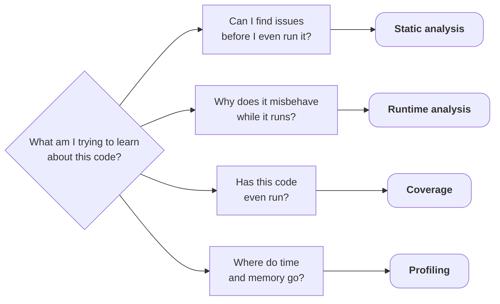
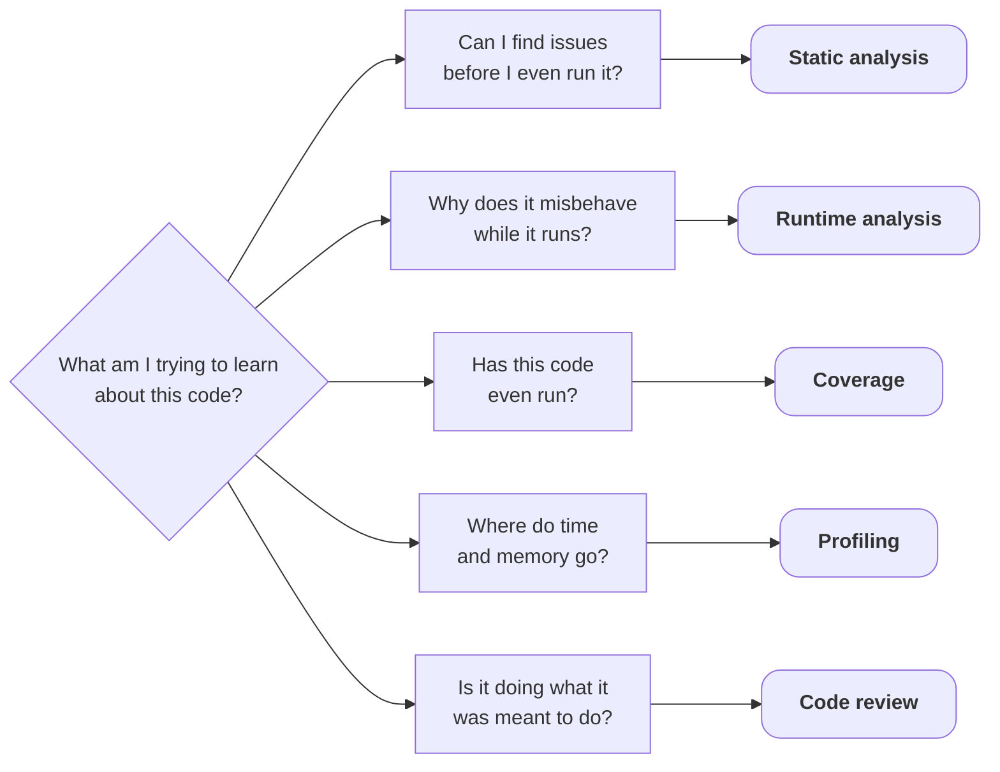

<v-switch>

<template #0>



</template>

<template #1>

<Transform :scale="0.8">



</Transform>

</template>

</v-switch>

---
layout: default
title: Code review
---

## Is this code doing what it was meant to do?

Back to the *original* listing, before any tool touched it:

<!-- Snippet from @/testing/0-initial/main.cpp (inside main, dedented). The `false` was removed in chapter 2 and the `return` added in chapter 4, hence the rewind framing. -->
```cpp [main.cpp ~i-vscode-icons:file-type-cpp~]{lines: false}
if (readings.empty())
{
    std::cout << "warning: no readings loaded\n";
}

printReport(computeStats(readings), false);
```

<v-clicks>

* Warn and then compute the stats anyway?
* What is that `false`?

</v-clicks>

<span v-click>But reviewers are inconsistent...</span>

<v-clicks>

* Tired by the tenth file
* Lazier on a Friday
* Blind to a 64 $\rightarrow$ 32 bit narrowing

</v-clicks>

<!-- ### Notes:
* Coverage needed instrumentation and merged runs, a reader needs **one raised eyebrow**
* Naming, API design, misleading control flow: reviewer territory
-->

---
layout: default
title: What only a reader can enforce
---

## What only a reader can enforce

There are many conventions no linter **should** formalize:

<v-clicks>

* Layering rules, "warnings go to `stderr`", meaningful names
* Ownership semantics: who is responsible for deleting?
* Readable diagnostics
* No deterministic tool measures whether a message helps at 3 a.m.

</v-clicks>

<v-click>

But can this be automated?

</v-click>

---
layout: default
title: The blind review
info: |
  * Methodology: Claude Fable 5, one isolated agent run. Input: ONLY the three original source files pasted inline. No repo access, no talk context, no tools, no compiler, no execution.
  * Full run captured verbatim in @/testing/code-review/run-fable.md (tokens, wall-clock and cost in its header). Token counts are harness totals, internal reasoning included and billed as output.
---

## Reviewing with AI

"Find every problem by reading alone."

<!-- ### Notes:
* Water: Mistral (Jul 2025, Mistral Large 2 lifecycle analysis with ADEME / Carbone 4) reports 45 mL of water per 400-token response, upstream (hardware, training) included. 11,622 / 400 x 45 mL = 1.3 L.
* Estimates vary wildly: Google (Aug 2025, arXiv:2508.15734) puts a median Gemini text prompt at 0.26 mL. The Mistral rate is the high end, chosen for the joke.
-->

<div v-click>

<!-- Verbatim finding titles from the captured single run; full text: @/testing/code-review/run-fable.md -->
```txt {lines: false}
 1. Out-of-bounds write in histogram - UB (memory corruption)
 2. Division by zero on empty input - UB
 3. Signed overflow when summing - UB
 4. Memory leak / raw owning pointer - leak + API design
 5. File-open failure is silently treated as "no readings" - robustness / bug
 6. Malformed input silently truncates the data - robustness
 7. Truncating narrowing conversions in computeStats - bug (portability/correctness)
 8. countDistinct is O(n²) - performance
 9. Dead/unused code - style (and a smell)
10. Include hygiene - style
11. Minor style / idiom
```

</div>

<v-click at="2">

74 seconds, 11,622 tokens ($0.43)<span v-click="3">, and about 1.3 L of water</span>

</v-click>

---
layout: default
title: The scorecard
---

<!-- The planted-bug ledger of @/testing/0-initial, file:line in that listing, and the Fable run's finding number for each (@/testing/code-review/run-fable.md, 2026-09-14):
     unused variable checksum, main.cpp:44 (-Wall) -> #9
     unused parameter verbose, main.cpp:29 (-Wextra) -> #9
     int count = readings.size() narrowing, stats.cpp:19 (-Wconversion / clang-tidy) -> #7
     <string> included but unused in stats.hpp; main.cpp uses std::string/std::vector only transitively (IWYU) -> #10 (both halves)
     reading == 100 -> buckets[10], data-dependent stack OOB, main.cpp:24 (ASan; hardened stdlib) -> #1
     sum += r signed overflow on corrupt data, stats.cpp:16 (UBSan) -> #3
     sum / count division by zero on empty input, stats.cpp:20 (UBSan, via coverage) -> #2
     loadReadings returns an owning raw pointer main never deletes; cross-TU, invisible to clang-tidy/cppcheck/clang-analyzer (LSan) -> #4
     empty-input branch warns but forgets return, main.cpp:47-50 (coverage: 0 hits) -> #2 ("the check exists but doesn't guard anything") + #11
     countDistinct is O(n*d), stats.cpp:24 (profiler) -> #8
     Fable's #5, #6, the mean-truncation half of #7 and the intent halves of #9 (boolean-flag anti-pattern) / #2 (warn-then-proceed UX) were reported by no deterministic tool in chapters 2-6 (the "What only the AI flagged" slide). -->

<Transform :scale="0.8">

| Planted bug | Caught in this talk by | Blind AI |
|---|---|---|
| unused variable `checksum` | `-Wall` | <emojione-white-heavy-check-mark/> |
| unused parameter `verbose` | `-Wextra` | <emojione-white-heavy-check-mark/> |
| `size()` $\rightarrow$ `int` narrowing | `-Wconversion` / clang-tidy | <emojione-white-heavy-check-mark/> |
| include hygiene | include-what-you-use | <emojione-white-heavy-check-mark/> |
| out-of-bounds histogram write | ASan | <emojione-white-heavy-check-mark/> |
| signed overflow in `sum` | UBSan | <emojione-white-heavy-check-mark/> |
| division by zero on empty input | UBSan | <emojione-white-heavy-check-mark/> |
| leaked `loadReadings` vector | LeakSanitizer | <emojione-white-heavy-check-mark/> |
| warn-but-no-`return` branch | coverage | <emojione-white-heavy-check-mark/> |
| quadratic `countDistinct` | perf | <emojione-white-heavy-check-mark/> |

</Transform>

<!-- ### Notes:
* All bugs from four tool chapters, in one read, with zero execution
-->

---
layout: default
title: Four models, one prompt
clicks: 4
---

## Same prompt, four models

<!-- Runs captured verbatim: @/testing/code-review/run-{fable,opus,sonnet,haiku}.md, one run each, 2026-09-14, identical prompt (@/testing/code-review/prompt.md).
     Scoring against the 10-bug ledger (see the scorecard slide's comment); "false claim" = a factually wrong statement about the code's behaviour (none in any run).
     Planted bug -> finding number per model (bugs in the scorecard slide's order):
       Opus 5:    checksum #13, verbose #12, narrowing #5, include hygiene #14 (both halves), out-of-bounds write #1, signed overflow #3, division by zero #2, leak #4 (+#11), missing return #9, quadratic countDistinct #10. Deepest extras: uninitialized Stats members, [[nodiscard]], <cstddef> via transitive include, trailing space in the histogram line, decoupled bucket constants.
       Sonnet 5:  checksum #10, verbose #9, narrowing #6, include hygiene MISSED (its #15 is about <cstddef> in stats.cpp; the unused <string> and main.cpp's transitive includes are never mentioned), out-of-bounds write #1, signed overflow #7, division by zero #3, leak #2, missing return #3+#13, quadratic countDistinct #8.
                  Caveat: Sonnet's file:line citations are wrong in most findings (e.g. histogram at "main.cpp:29", checksum at "main.cpp:19", countDistinct at "stats.cpp:29-45"); the descriptions themselves are correct, so this is counted as sloppy citation rather than a false claim about the code.
       Haiku 4.5: checksum #8 (+#10, a duplicate), verbose #7, narrowing #9, out-of-bounds write #2, division by zero #1, leak #3, missing return #5, quadratic countDistinct #6. Missed: the signed overflow (only fixed silently in its rewrite, "long long to avoid overflow", never reported) and include hygiene.
     Tokens are harness totals per run (input incl. the prompt-cache write + output incl. internal reasoning). Cost is the harness-reported figure at Anthropic list prices, September 2026: Fable $10/$50, Opus $5/$25, Sonnet $2/$10, Haiku $1/$5 per MTok in/out; the prompt was written to a 1 h prompt cache, which bills input at 2x.
     cents/LoC uses the exact v0 size: 118 lines (main.cpp 60 + stats.hpp 14 + stats.cpp 44). -->

<v-switch>

<template #0>

| Model | Findings | Identified | Missed | False claims | Tokens | Time | Cost | ¢ / LoC |
|---|---|---|---|---|---|---|---|---|
| Fable 5 | 11 | **10/10** | 0 | 0 | 11.6 k | 74 s | ≈ $0.43 | 0.4 |

</template>

<template #1>

| Model | Findings | Identified | Missed | False claims | Tokens | Time | Cost | ¢ / LoC |
|---|---|---|---|---|---|---|---|---|
| Fable 5 | 11 | **10/10** | 0 | 0 | 11.6 k | 74 s | ≈ $0.43 | 0.4 |
| Opus 5 | 17 | **10/10** | 0 | 0 | 15.1 k | 120 s | ≈ $0.31 | 0.3 |

</template>

<template #2>

| Model | Findings | Identified | Missed | False claims | Tokens | Time | Cost | ¢ / LoC |
|---|---|---|---|---|---|---|---|---|
| Fable 5 | 11 | **10/10** | 0 | 0 | 11.6 k | 74 s | ≈ $0.43 | 0.4 |
| Opus 5 | 17 | **10/10** | 0 | 0 | 15.1 k | 120 s | ≈ $0.31 | 0.3 |
| Sonnet 5 | 15 | 9/10 | 1 | 0 | 14.7 k | 40 s | ≈ $0.07 | 0.06 |

</template>

<template #3-5>

| Model | Findings | Identified | Missed | False claims | Tokens | Time | Cost | ¢ / LoC |
|---|---|---|---|---|---|---|---|---|
| Fable 5 | 11 | **10/10** | 0 | 0 | 11.6 k | 74 s | ≈ $0.43 | 0.4 |
| Opus 5 | 17 | **10/10** | 0 | 0 | 15.1 k | 120 s | ≈ $0.31 | 0.3 |
| Sonnet 5 | 15 | 9/10 | 1 | 0 | 14.7 k | 40 s | ≈ $0.07 | 0.06 |
| Haiku 4.5 | 10 | 8/10 | 2 | 0 | 14.4 k | 44 s | ≈ $0.05 | 0.04 |

</template>

</v-switch>

<v-clicks at="4">

* Sonnet 5 missed the include hygiene, Haiku 4.5 also missed the signed overflow

</v-clicks>

<!-- ### Notes:
* Haiku's "rewritten highlights" section quietly switched `sum` to `long long` "to avoid overflow" without ever reporting the bug: a silent fix hiding an unreported finding.
* Sonnet's descriptions were all correct, but its file:line citations were wrong in most findings (off by up to 25 lines). Read the finding, don't trust the line.
* The cents-per-line column is upper-bound intuition: output tokens dominated these runs. On larger code, input grows with the code while findings per line drop.
-->

---
layout: default
title: What only the AI flagged
---

## Findings no deterministic tool reported

<br>

* Readings `{1, 2}` report mean `1` (silent truncation)

<v-clicks>

* Malformed input: `12 abc 34` stops parsing at `abc` and silently drops the rest of the file
* Warn but proceed: misleading UX
* `verbose` flagged as a boolean-flag anti-pattern

</v-clicks>

<!-- ### Notes:
* It reads like a reviewer, not like a checker
-->

---
layout: default
title: vs the human reviewer
clicks: 7
---

## Human review cost

<!--  118 LoC at the study's effective band: 400 LoC/60 min (fast edge) gives 17.7 min, 200 LoC/90 min (slow edge) gives 53.1 min. Wage floor: 18 min x $64/h = ~$19. Ceiling: 53 min x $90/h = ~$80. Hence $20-80. The x-factor vs the AI runs: $20/$0.43 = 47x up to $80/$0.05 = 1600x. -->
<!-- (1) SmartBear/Cisco: "Best Kept Secrets of Peer Code Review" Cisco case study (2,500 reviews, 3.2M LoC) - smartbear.com/learn/code-review/best-practices-for-peer-code-review: "review no more than 200 to 400 LOC at a time", "a review of 200-400 LOC over 60 to 90 minutes should yield 70-90% defect discovery", detection degrades past ~500 LoC/h. -->
<!-- (2) US BLS Occupational Outlook Handbook, Software Developers: median $133,080/yr, May 2024 - bls.gov/ooh/computer-and-information-technology/software-developers.htm. -->
<!-- (3) BLS Employer Costs for Employee Compensation: benefits run ~30% of total compensation, so loaded cost = wage/0.7 = ~$90/h - bls.gov/ecec. -->

<!-- Water: EFSA adequate intake (Dietary Reference Values for water, 2010) is 2.0 L/day (women) to 2.5 L/day (men), fluids and food moisture combined. 2.5 L / 1440 min = 1.7 mL/min; 18 min -> 31 mL, 53 min -> 92 mL. -->

<v-switch>

<template #0>

| Published number | Value | Source |
|---|---|---|

</template>

<template #1>

| Published number | Value | Source |
|---|---|---|
| Effective review speed | 200-400 LoC per 60-90 min<br>70-90 % of defects | SmartBear-Cisco study (2,500 reviews) |

</template>

<template #2>

| Published number | Value | Source |
|---|---|---|
| Effective review speed | 200-400 LoC per 60-90 min<br>70-90 % of defects | SmartBear-Cisco study (2,500 reviews) |
| Median US developer pay | $133,080 / yr ≈ $64 / h | US BLS, May 2024 |

</template>

<template #3-8>

| Published number | Value | Source |
|---|---|---|
| Effective review speed | 200-400 LoC per 60-90 min<br>70-90 % of defects | SmartBear-Cisco study (2,500 reviews) |
| Median US developer pay | $133,080 / yr ≈ $64 / h | US BLS, May 2024 |
| Full hourly cost | ≈ $90 / h (adding benefits) | BLS ECEC |

</template>

</v-switch>

<br>

<v-clicks at="4" depth="2">

* Our 118 LoC: **18-53 minutes** ≈ **$20-80** <span v-click="7">(+30-90 mL of water)</span>
    * The AI runs: **40-120 seconds** ≈ **$0.05-$0.43**
* But human review brings what no model can: design pushback, context, **ownership**

</v-clicks>

<!-- ### Notes:
* The study's 70-90 % defect discovery is the Haiku row
* Bacchelli & Bird, "Expectations, Outcomes, and Challenges of Modern Code Review" (Microsoft, ICSE 2013): defect-finding is the top stated motivation for review, but measured outcomes skew to code improvement, knowledge transfer and shared ownership. This comparison prices the defect sweep only.
-->

---
layout: default
title: Analysis, tests, review
---

## Analysis complements tests and review

<br>

* Checks assert what the program should do, code analysis checks how it does it

<v-clicks depth="2">

* Review catches design and intent problems no other tool can see
   * Analysis scales to every line of every build, reviewers can't (and shouldn't!)

</v-clicks>
