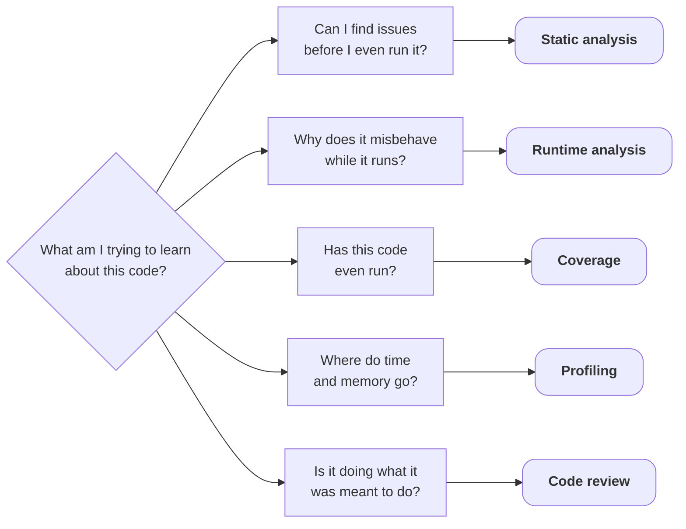

# Conclusion

---
layout: default
title: What a clean result proves
---

## What code analysis proves

 

<v-switch>

<template #0>

| Output              | What that detects                 |
|---------------------|-----------------------------------|
| No warnings         | none of the enabled checks fired  |
| Sanitizers silent   | no bug on the paths you ran       |
| 100 % coverage      | every line ran                    |
| Flat profile        | no hotspot in this workload       |
| PR approved         | no issues found by the reviewer   |

</template>

<template #1-3>

| Output              | What that detects                 | What it says nothing about                    |
|---------------------|-----------------------------------|-----------------------------------------------|
| No warnings         | none of the enabled checks fired  | checks you did not enable |
| Sanitizers silent   | no bug on the paths you ran       | paths you did not run |
| 100 % coverage      | every line ran                    | whether any result was checked |
| Flat profile        | no hotspot in this workload       | what you did not measure |
| PR approved         | no issues found by the reviewer   | what the reviewer did not see |

</template>

</v-switch>

<v-click at="2">

No single step replaces the others

</v-click>

---
layout: fact
title: 'The question map: complete'
---

<Transform :scale="0.8">

</Transform>

---
layout: default
title: It's all code analysis
---

