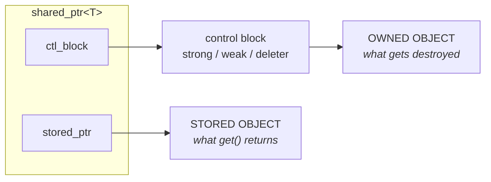

# `shared_ptr`

## Sharing one object, pointing to another

<footer class="absolute bottom-[20%] left-0 right-0 text-center">Alexsandro Thomas</footer>

---
layout: default
---

## Quick poll

<br>

Who is familiar with `std::shared_ptr`?

```cpp [main.cpp ~i-vscode-icons:file-type-cpp~]
T* obj = new T;             // the object to keep alive
std::shared_ptr<T> p(obj);
```

---
layout: default
---

## Quick poll

<br>

Does `p` return `obj` from `get()`?

```cpp [main.cpp ~i-vscode-icons:file-type-cpp~]
T* obj = new T;
std::shared_ptr<T> p(obj);
T* raw = p.get();           // raw == obj?
```

---
layout: default
---

## Quick poll

<br>

Does `p` delete `obj`?

```cpp [main.cpp ~i-vscode-icons:file-type-cpp~]
T* obj = new T;
std::shared_ptr<T> p =   /* ... */;
assert(p.get() == obj);  // p stores obj

p.reset();               // deletes obj?
```

---
layout: fact
---

## Technically... no.

*It's the most useful lie we tell about `shared_ptr`.*

---
layout: center
---

## \[util.smartptr.shared.obs\]

```cpp
constexpr element_type* get() const noexcept;
```

> *Returns:* The <span v-mark.red=2>stored</span> pointer.

<br>

<v-click>

Two separate concepts:

</v-click>

<v-clicks>

- **stored**: what `get()` returns
- **owned**: what the deleter destroys

</v-clicks>

---
layout: default
---

## A `shared_ptr` is two pointers, not one.

<br><br>



---
layout: default
---

## The aliasing constructor

<br>

```cpp [<memory> ~i-vscode-icons:file-type-cppheader~]
template <class Y>
shared_ptr(const shared_ptr<Y>& r, T* ptr) noexcept;
```

<br>

<v-clicks>

- `r` is what we **co-own**, `ptr` is what `get()` **returns**
- `T` and `Y` don't have to be related at all
    - `noexcept`, so no validation
- The deleter runs on <span v-mark.red=3>`r`'s</span> pointer, not on `ptr`

</v-clicks>

<v-click>

The whole thing, hand-rolled:

```cpp
template <class T, class Y>
struct AliasedPtr {
    std::shared_ptr<Y> owner;  // co-owns: keeps the object alive
    T*                 ptr;    // non-owns: what you actually access
};
```

</v-click>

---
layout: default
---

## What's it good for?

<br>

A few examples:

- **Cast hierarchies**
- **Member / subobject access**
- **Lifetime tokens**
- **Pimpl bridges**
- **FFI lifelines**

---
layout: default
---

## Cast hierarchies

`static_pointer_cast` & friends are aliasing in disguise **by specification**:

```cpp [<memory> ~i-vscode-icons:file-type-cppheader~]
// [util.smartptr.shared.cast]
template<class T, class U>
  shared_ptr<T> static_pointer_cast(const shared_ptr<U>& r) noexcept;
```

<v-click>

> *Returns:* `shared_ptr<T>(r, static_cast<...>(r.get()))`

</v-click>

<v-click>

- `dynamic_`, `const_`, `reinterpret_pointer_cast`: same shape, swap the cast

</v-click>

---
layout: default
---

## Member / subobject access

Hand out `shared_ptr<Member>` from a parent `shared_ptr<Parent>`, without copying or reallocating

<br><br>

<div class="grid grid-cols-2 gap-x-6 items-center">

```cpp [main.cpp ~i-vscode-icons:file-type-cpp~]{*|1|3|4|6-7|*}{at: 1}
struct Parent { Member m; };

auto p = std::make_shared<Parent>();
std::shared_ptr<Member> mem(p, &p->m);

assert(p.use_count() == 2);
// Parent stays alive as long as mem lives.
```

<div>

<v-click at=5>

What you *don't* need:

</v-click>

<v-clicks at=5>

- `enable_shared_from_this`
- a second heap allocation
- to modify `Member` at all
- to remember the parent

</v-clicks>

</div>

</div>

---
layout: default
---

## Lifetime tokens

A `shared_ptr` whose stored pointer is null, just a refcount you can pass around.

```cpp [main.cpp ~i-vscode-icons:file-type-cpp~]{*|1|3|5|8}{at: 1}
auto parent = std::make_shared<Resource>();

std::shared_ptr<void> token(parent, nullptr);

assert(parent.use_count() == 2);
```

<v-clicks at=4>

- The deleter runs on `parent`'s pointer
- `T` doesn't have to be `void`
- The token can outlive every named `parent` reference

</v-clicks>

<v-click at=7>

<br>

*Hand out the lifetime, not the object.*

</v-click>

---
layout: default
---

## Pimpl bridges

Expose an internal piece, tied to the wrapper's lifetime.

```cpp [widget.hpp ~i-vscode-icons:file-type-cppheader~]
class Widget {
    std::shared_ptr<struct Impl> impl_;
public:
    std::shared_ptr<Renderer> renderer();
};
```

```cpp [widget.cpp ~i-vscode-icons:file-type-cpp~]
struct Impl { /* ... */ Renderer rnd; };

std::shared_ptr<Renderer> Widget::renderer() {
    return {impl_, &impl_->rnd};
}
```

<v-clicks>

- Caller never sees `Impl`, header stays ABI-stable
- The `Renderer` alias pins `Impl` until the last handle is gone
- `Widget` itself can die first; the consumer keeps using `Renderer` safely

</v-clicks>

---
layout: default
---

## FFI lifelines

<br>

```cpp [bindings.cpp ~i-vscode-icons:file-type-cpp~]{*|1-4|6-8|*}{at: 1}
struct Engine {
    GlobalLoggerInstance log;       // Engine needs the logger alive for its whole life
    Job  make_job();                // factory: a Job bound to this engine
};

struct Job {
    ~Job() { globalLog("Done"); }   // ~Job needs the engine
};
```

```python [main.py ~i-vscode-icons:file-type-python~]{hide|*}{at: 3}
engine = Engine()
job    = engine.make_job()
```

<v-clicks at=4>

- Nothing tells Python that `~Job` depends on `engine`
- `engine` may go first

</v-clicks>

---
layout: default
---

## Bundle the dependency, hand out an alias

<br>

```cpp [bindings.cpp ~i-vscode-icons:file-type-cpp~]{*|1-4|7|8}{at: 1}
struct JobHolder {
    std::shared_ptr<Engine> engine;  // declared first → outlives `job`
    Job                     job;     // the thing we hand out
};

std::shared_ptr<Job> share_job(std::shared_ptr<Engine> engine) {
    auto h = std::make_shared<JobHolder>(engine, engine->make_job());
    return std::shared_ptr<Job>(h, &h->job);   // aliasing: pins the bundle
}
```

<div class="grid grid-cols-2 gap-x-6 mt-4">

<v-click at=4>

**Python's view**

Holds only a `Job`.
*Can drop every `Engine` reference.*

</v-click>

<v-click at=5>

**C++'s view**

The `Engine` lives until the last `Job` dies.
*`~Job` always has a live engine.*

</v-click>

</div>

---
layout: default
---

## Pitfalls: aliasing doesn't do any safety checks

Aliasing keeps the parent alive, not the address valid:

```cpp [main.cpp ~i-vscode-icons:file-type-cpp~]{*|1|2|4|5|7|8}{at: 1}
auto vec = std::make_shared<std::vector<Item>>();
vec->push_back({});                               // vector allocates a buffer

Item* p = &vec->front();                          // raw pointer into that buffer
std::shared_ptr<Item> alias(vec, p);              // alias co-owns vec, stores p

vec->push_back({});                               // may reallocate → buffer moves
*alias;                                           // p is dangling. UB.
```

<v-click at=7>

> Aliasing protects against **the parent dying**.
> It does **not** protect against the parent invalidating its own interior pointers.

</v-click>

<v-click at=8>

*Other things the type system won't catch:*
- string SBO moves
- `unordered_map` rehash
- `operator==` vs `owner_before`

</v-click>

---
layout: default
---

## Pitfalls: aliasing breaks `enable_shared_from_this`

<br>

```cpp [main.cpp ~i-vscode-icons:file-type-cpp~]{*|1-2|4-5|7}{at: 1}
struct Member : std::enable_shared_from_this<Member> { /* ... */ };
struct Parent { Member m; };

auto p   = std::make_shared<Parent>();
auto mem = std::shared_ptr<Member>(p, &p->m);   // Member's first shared_ptr is an alias

mem->shared_from_this();   // throws std::bad_weak_ptr
```

---
layout: fact
---

A `shared_ptr` is **two pointers**, not one.

<v-clicks>

The one you *see* is just a viewport, the one you *don't see* is the lifeline

The aliasing constructor lets you point those two at **completely different things**

</v-clicks>

---
layout: end
---

## Thank you!

---
layout: default
---

## `keep_alive` vs aliasing: where each one wins.

<br>

<div class="grid grid-cols-2 gap-x-6">

<div>

### `py::keep_alive<N, P>`

*`Python`-side link*

- **Lives in** Python wrappers, not C++ refs
- **Enforced by** pybind11's patient list
- **Breaks if** C++ releases the parent itself
- **Best for** Python-only objects (numpy views...)

</div>

<div>

### aliasing `shared_ptr`

*`C++`-side refcount*

- **Lives in** the C++ control block, language-agnostic
- **Enforced by** the strong reference count
- **Survives** Python losing every wrapper
- **Best for** C++ ownership exposed across FFI

</div>

</div>

*Different layers. Use both, they **compose**.*

---
layout: default
---

## Aliasing vs `enable_shared_from_this`.

<br>

<div class="grid grid-cols-2 gap-x-6">

<div>

### `enable_shared_from_this`

- Intrusive: changes the class
- Only works on the object itself
- Adds a `weak_ptr` to every instance
- A member needs its own allocation to be owned
- Throws `bad_weak_ptr` in ctor / dtor

</div>

<div>

### aliasing constructor

- Non-intrusive, no base class needed
- Works for any subobject
- Zero per-instance overhead
- Keeps `make_shared`'s single allocation
- No special states, no surprises

</div>

</div>
